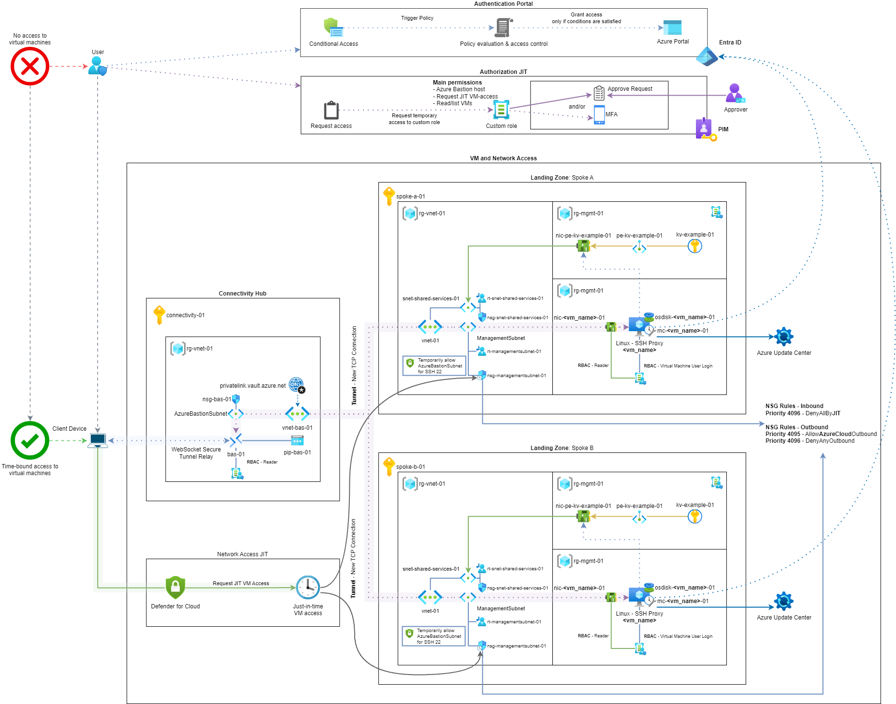

# Bastion Tunnel 🛣️ Vision: Local Access to Private Azure Resources

> [!NOTE]  
> I try to keep this documentation up to date as much as possible. If you find something that is outdated or incorrect, please open an issue or a pull request.

Recently, I found myself in a situation where I could not create a proper solution to provide teams in Azure with access to their Landing Zone (especially Private Azure Resources). Some of the common solutions were not an option:

- Client VPN.
- Azure Virtual Desktop.
- DevBox.
- Other possible solutions that would meet the requirements.

## Situation

Months ago, I was asked to come up with a solution to provide access to a Landing Zone in Azure. This was not my first time thinking about this, but this time the situation was different.

As mentioned in the [beginning](#bastion-tunnel-️-vision-local-access-to-private-azure-resources), I could not use many of the common solutions. There were many reasons for this, but we will not go into that. Instead, I will focus on the solution I came up with.

## Solution

I was working on a combination of Azure Bastion (in the Connectivity Hub) and a traditional Windows jumpbox (per Landing Zone). However, I was not satisfied with this solution, as it would require significant management and maintenance. During my research, I stumbled upon a few forums discussing Azure Bastion Tunneling and a SOCKS5 proxy. At first, I did not dive into it, but after talking to a colleague (who had some experience with it), we decided to give it a try.

This solution gives you the ability to access Private Azure Resources (with Private Endpoints) from your local machine, using only your web browser and a tunnel through Azure Bastion to a Linux VM in the Landing Zone. The Linux VM acts as an SSH proxy server. It is lightweight and easier to maintain. Additionally, you can enable [JIT](https://learn.microsoft.com/en-us/azure/defender-for-cloud/enable-just-in-time-access) to restrict network access to the Linux VM.

### Details

To reach a Private Azure Resource (such as a Key Vault with a Private Endpoint) from your local machine, you either need to be in the same VNet (or peered VNet) or use something like a VPN or ExpressRoute connection. However, with this solution, you can create a tunnel from your local machine to a Linux VM in the Landing Zone using Azure Bastion Tunneling and route your web browser traffic through a SOCKS5 proxy. Not just your web browser traffic—other applications that support SOCKS5 proxies can also use this tunnel to access Private Azure Resources.

#### SOCKS5 vs SOCKS5H

First things first, what is a SOCKS5 proxy and what is the difference between SOCKS5 and SOCKS5H?

##### What is a SOCKS5 proxy?

A SOCKS5 proxy is a protocol that routes network packets between a client and server through a proxy server. It operates at a lower level than HTTP proxies, allowing it to handle various types of traffic, including TCP and UDP. This makes SOCKS5 proxies versatile for different applications, such as web browsing, email, and file transfers.

##### Difference between SOCKS5 and SOCKS5H

The difference between SOCKS5 and SOCKS5H lies in how they handle DNS resolution:

- **SOCKS5**: With SOCKS5, the client is responsible for DNS resolution. This means that the client resolves the domain names to IP addresses before sending the requests through the proxy server. This can potentially expose DNS queries to the local network, which may not be desirable when trying to maintain privacy or access resources in a different network.
- **SOCKS5H**: In contrast, SOCKS5H (the "H" stands for "Hostname") delegates DNS resolution to the proxy server. When using SOCKS5H, the client sends the domain names directly to the proxy server, which then resolves them to IP addresses. This approach enhances privacy and security, as DNS queries are handled within the proxy server's network, making it suitable for accessing resources in different networks without exposing DNS traffic.

### Diagram

Below you can find the diagram of the solution:



[Draw.io file here](../assets/bastion_tunneling-ssh_socks5_proxy.drawio).

### Breakdown

The solution looks massive, but it is quite simple when you break it down:

1. The user connects to the Azure Portal from their client device. The authentication is done using Entra ID.
2. The user requests access to resources. Before the user can connect to private Azure resources, make sure these roles are assigned:
   - The user has access to the Bastion Host in the Connectivity Hub (using a **custom role** in PIM or another approach).
   - The user can request JIT VM access in the Landing Zone (using a **custom role** in PIM or another approach).
   - The user has access to the Linux jumpbox VM (including the Network Interface) in the Landing Zone (using the default **Reader** and **Virtual Machine User Login** roles).
3. When access is granted, the user connects to the Bastion Host in the Connectivity Hub through the Azure CLI using:

```bash
az login
az account set --subscription <subscription-id-or-name-of-bastion>
az network bastion tunnel --name <bastion-name> --resource-group <bastion-rg> --target-resource-id <linux-vm-resource-id> --resource-port 22 --port <local-port>
```

<!-- markdownlint-disable MD029 -->
4. The Bastion Host creates a tunnel to the Linux jumpbox VM in the Landing Zone.
5. The Linux jumpbox VM is Entra ID joined, so the user can authenticate using their Entra ID credentials.
6. The Linux jumpbox VM forwards the traffic to the Private Azure Key Vault through the Private Endpoint.
7. The Private Azure Key Vault responds to the request and sends the data back through the same path.
8. The user configures the web browser to use a SOCKS5 proxy pointing to `localhost:<local-port>`.
9. The user can now access Private Azure Resources through the SOCKS5 proxy configured in the web browser.
10. When the user is done, close the tunnel by stopping the Azure CLI command.
11. The user can remove the SOCKS5 proxy configuration from the web browser.
12. Access is revoked when the JIT access time window expires, or the user manually removes their access in PIM.
<!-- markdownlint-enable MD029 -->

## Conclusion

When one of the common options is not available, this solution can provide a way to access Private Azure Resources from your local machine. It leverages Azure Bastion Tunneling and a SOCKS5 proxy to create a secure tunnel to a Linux jumpbox VM in the Landing Zone. Leveraging Entra ID and JIT access in Defender for Cloud adds an extra layer of security to the solution!
